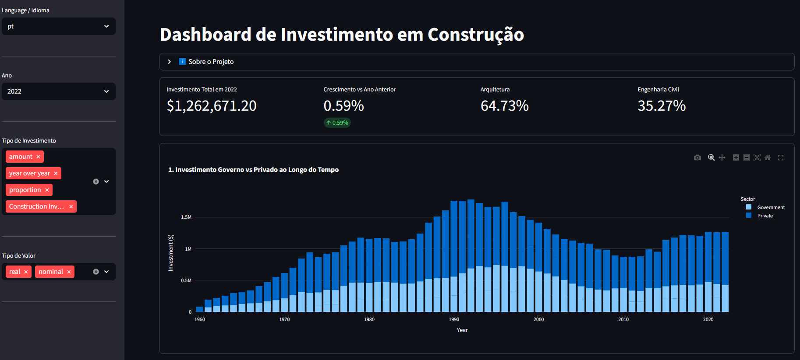

# Construction Investment Dashboard (Japan)
Interactive data dashboard built with Python, Pandas, Plotly, and Streamlit to analyze long-term construction investment trends in Japan.

## Objective
Understand how construction investment evolved over time and how financial resources are distributed between sectors, construction types, and public versus private participation.

## Key Insights Provided
**This dashboard helps answer:**
- Is the construction sector growing or shrinking?
- Who invests more: Government or Private sector?
- Is investment focused on residential or non-residential construction?
- Is the industrial sector (mining & industry) expanding?
- Is the country building new infrastructure or focusing on renovations?

## Metrics
**1. Total Investment by Year**
- Total construction investment for the selected year.

**2. Growth vs Last Year**
- Economic trend indicator showing whether the sector is expanding or contracting.

**3. % Architecture**
- Share of total investment allocated to building construction.

**4. % Civil Engineering**
- Share of total investment allocated to infrastructure projects.

## Visualizations
**1. Government vs Private Investment Over Time**
- Sector participation across the years
- Shows both total investment and proportional contribution
- Helps identify changes in dependence on public or private funding

**2. Residential vs Non-Residential Construction**
- Housing versus economic infrastructure
- Compares homes and apartments with commercial and industrial buildings

**3. Private Investment in Mining & Industry Over Time**
- Indicator of industrial sector strength
- Shows long-term trends in productive economic investment

**4. Renovation vs New Construction Over Time**
- Market behavior (expansion vs maintenance)
- Compares renovation activity with new construction
- Indicates whether the sector is expanding or focusing on upgrades

## Tech Stack
- **Python**
- *Pandas*
- *Plotly*
- *Streamlit*

## Run Locally
'''bash pip install -r requirements.txt'''
'''bash streamlit run main.py'''